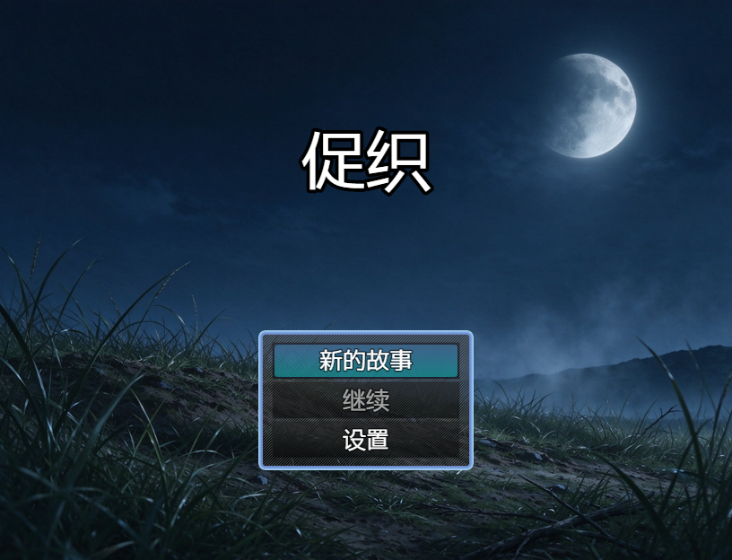
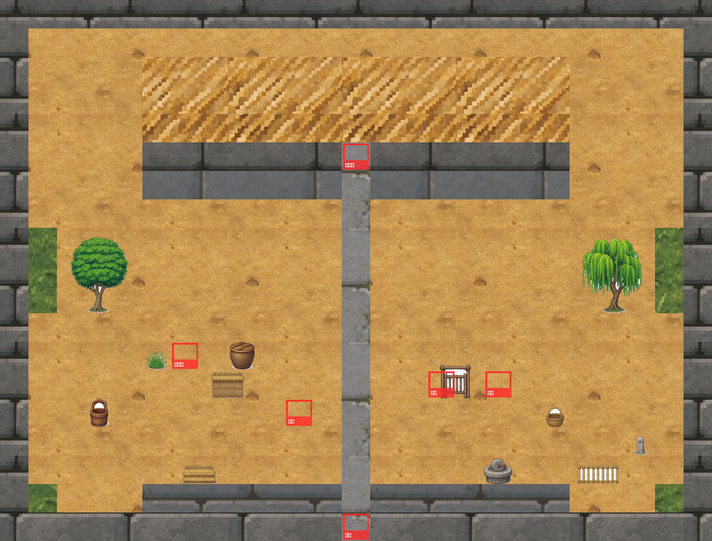
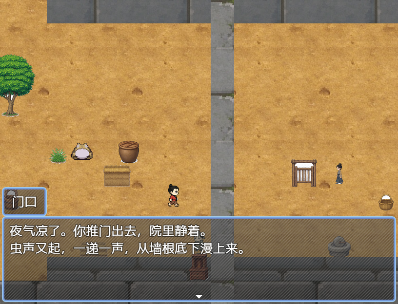
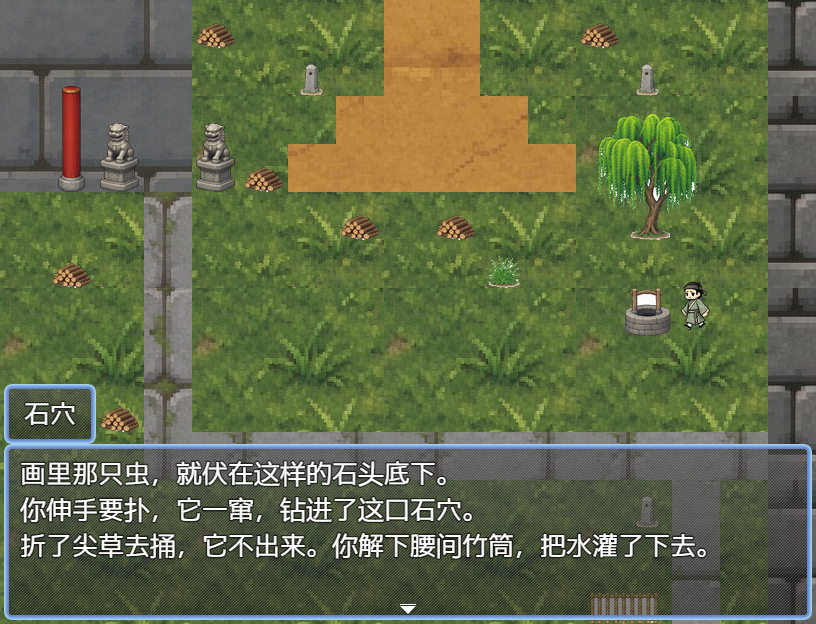
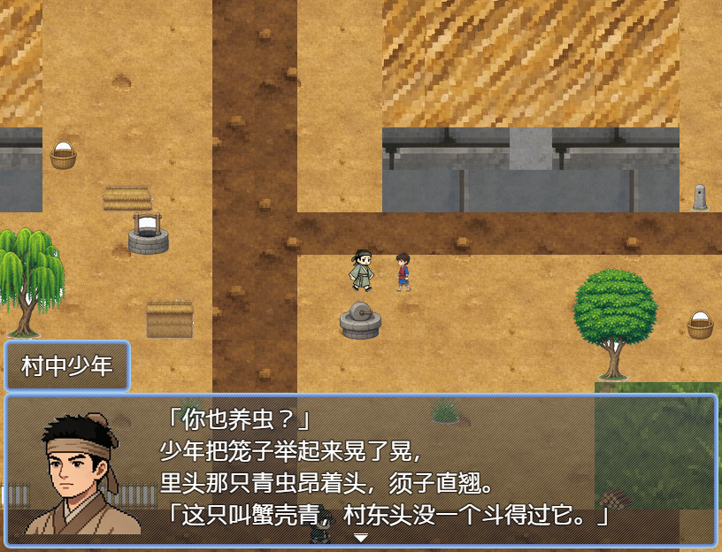

# 《促织》· RPG Maker MZ 剧情游戏与内容生产管线

把蒲松龄的《促织》改编成一部**可在线试玩的剧情游戏**，并把整个生产过程做成一条**可复现的编译管线**：

```
结构化剧本（Python 数据）  →  一条命令  →  完整可运行的游戏工程
```

**▶ 在线试玩**：<https://lusica-baby.github.io/rpgmaker-ai-pipeline/>

进入后**先点一下画面**才会有声音（浏览器 WebAudio 策略）。完整流程约 10 分钟。

📄 [执行大纲](执行大纲.md)（范围与验收标准） ｜ 🔧 [引擎契约](引擎契约.md)（踩出来的 30 余条隐藏约定）



---

## 这是什么

一个 7 天的个人项目。但它要回答的不是"怎么用引擎做游戏"，而是一个工程问题：

> 引擎的地图、事件、台词全靠编辑器逐格手工录入，改一处要重做一片；而且它有**一大批约定是"填错不报错、只在运行时静默失效"**——参数写错一个字节，墙变得可以穿、条件判断永远走 else、台词被裁掉半句，全程一句错都不报。
>
> 人力守不住这种东西。能不能把游戏内容当成**编译目标**，用结构化数据描述、一条命令生成、再用断言把每一条约定钉死？

答案在 `tools/` 里的 26 个 Python 工具。

## 三层管线

| 层 | 文件 | 职责 |
|---|---|---|
| **数据层** | `tools/game_data.py` | 纯业务内容：地图 ASCII 布局、事件与台词、道具与开关。**零引擎 ID** |
| **构建层** | `tools/build_project.py` | 唯一写引擎 JSON 的地方，把数据层编译成完整 MZ 工程 |
| **验证层** | `tools/validate_project.py`、`tools/playtest.py` | 20 项静态校验 + 真机走查 |

分层不是洁癖：**数据层不含任何引擎 ID，所以可以整体交给 LLM 生成而不会破坏引擎契约**；构建层与验证层是人写的、带断言的部分。这就是项目名里 "AI pipeline" 的落点。

## 数字

| 项 | 值 |
|---|---|
| 地图 / 主线 / 台词 | 4 张地图、9 段主线剧情、170 行台词 |
| 角色美术 | 8 张 144×144 脸图、9 套行走图（自绘 + AI 生成图二次加工） |
| 静态校验 | `validate_project` PASS **20/20** |
| 真机走查 | 6 个传送门双向、全部事件可达、**0 运行时错误**、音频断言 12 条全命中 |
| 台词折行 | 构建器自动折行，与引擎实测字体宽度**偏差 0px** |
| 工程体积 | 模板 100 MB → **21.6 MB**（构建末步按引用裁剪，见下） |

## 构建的最后一步：按引用裁剪素材

MZ 的 `newdata` 模板会把整套 RTP 复制进来，而游戏真正引用到的只有零头——**79 MB 的战背景、无用的 BGM、模板图块集**。构建的第 7 步（`tools/prune_assets.py`）按引用裁剪：

- **引擎硬编码名**（`Window`/`IconSet`/`Balloon`…）在 `data/*.json` 里一个字都搜不到，只能现场解析 `js/rmmz_*.js` 里的 `loadSystem()` 字面量。少一个，某个 UI 元素就默默变空白。
- **数据引用**按"文件名是否作为字符串出现在 data 里"判定——这是引用的**超集**，可能多留（不同目录下的同名文件），但不会漏。
- **图块集**不能扫名字（`Tilesets.json` 里列着 7 张模板图块集），要走 `Map.tilesetId → tilesetNames` 这条真正的引用链，否则白留 62 张图。

裁剪与校验是一对：`prune` 保证"保留集合 ⊇ 数据里出现过的名字"，`validate_project[5b]` 保证"引用到的每个名字都真的有文件"，两边用**不同办法**判同一件事，免得同一种解析错误互相作证。

## 三条最有代表性的坑

每一条都是"不报错，但全错"，因此都被固化成了构建期 `assert`。

**① 图块通行位：`flags[0]` 必须是 `0x10`**
`allTiles()` 会把空图层的 tileId 0 也算进通行判定，而 `layeredTiles()` 按 z3→z0 降序、tileId 0 排在最前。于是 `flags[0]` 写 `0x00` 会让墙形同虚设，写 `0x0F` 会让整张图走不动。

**② 引擎根本不折行**
`flushTextState` 拿 `textWidth(text)` 一次 `drawText` 画完，唯一的换行源是 `\n`；横向超宽的部分被位图边界**静默裁掉**。因此折行必须由构建器负责——按标点断句、收尾标点不上行首、两行时取长边最短。宽度模型是实测复现的（ASCII 13px / 中日韩 26px，逐字相加与 `measureText` 偏差 0px）。

**③ 道具与开关的"未定义即静默"**
`$dataItems[未定义 id]` 不报错：`itemContainer(undefined)` 返回 null 直接跳过，`hasItem(undefined)` 恒为 false——道具漏登记 = 剧情悄悄走岔。开关更隐蔽，模板只有 21 个空名槽位。另外开关的判断条件 `111 case 0` 是**三**参数 `[id, ?, 0=开/1=关]`，只写两个会让 `undefined === 0` 为假，即永远判"关"。全部由 `install_switches()` + `validate_project[7]` 兜住。

更多同类条款见 **[引擎契约](引擎契约.md)**。

## 截图

| | |
|---|---|
|  |  |
| 标题画面（816×624，`scaleSprite` 对尺寸极其敏感） | 成家（整图渲染，用于人眼验收布局） |
|  |  |
| 对话窗与自动折行 | P4「按图索骥」：片纸 → 石穴得青麻头 |
|  | |
| P7 斗虫：与村中少年的蟹壳青 | |

## 本地运行

**方式一 · 直接在浏览器玩**（MZ 不能 `file://` 打开，`data/*.json` 会被 CORS 拦）

```bash
python tools/serve_game.py     # 或双击 play.bat
```

**方式二 · 编辑器内测试运行**：用 RPG Maker MZ 打开 `CuzhiDemo/game.rmmzproject`，按 F5。
> ⚠️ `CuzhiDemo/` 是**构建产物**，每次构建整棵覆盖——不要在编辑器里保存，改了也会被下次重建抹掉。

**方式三 · 从数据重新生成整个工程**

```bash
python tools/build_tiles.py        # 图块集与通行 flags
python tools/build_project.py      # 编译：数据层 → 完整 MZ 工程（末步顺带裁剪素材）
python tools/validate_project.py   # 静态校验（预期 PASS 20/20）
python tools/playtest.py           # 真机走查（需 RPG Maker MZ 装在默认路径）
```

四条里前三条只需要 Python + Pillow。**仓库之外**的依赖用环境变量指，工具里不写死绝对路径：

| 环境变量 | 指什么 | 谁需要 |
|---|---|---|
| `RPGMAKER_MZ` | MZ 安装目录（取 `newdata/` 当模板） | `build_project.py` |
| `MING_TILESETS` | 图块源包（第三方素材，体积大、不入库） | `build_tiles.py` |
| `AB_NODE` / `AB_CLI` | `agent-browser` 的 node 与入口脚本 | `playtest.py` |

## 目录结构

```
tools/
  game_data.py        数据层：地图布局、事件台词、道具开关（唯一该被 LLM 写的文件）
  build_project.py    构建层：唯一写引擎 JSON 的出口
  build_tiles.py      图块集与通行位
  prune_assets.py     按引用裁剪素材（构建的最后一步）
  validate_project.py 静态校验
  playtest.py         真机走查（BFS 可达 + 消息窗契约 + 剧情闸门 + 音频）
  line_fit.py         台词行宽快筛
  serve_game.py       本地试玩服务器
  import_*.py         素材导入（四类源料形态，各一个脚本，幂等）
CuzhiDemo/            生成的游戏工程（构建产物，勿手改）
剧本/                  改编文本与场景清单
docs/accept/           走查截图（逐事件、逐地图）
docs/screenshots/      README 用图
执行大纲.md            范围与验收标准
引擎契约.md            引擎隐藏约定汇总
```

## 素材来源

- 图块与音频：RPG Maker MZ 自带 RTP（在 MZ 制作的作品中可再分发）。**仓库里只保留本项目实际引用到的那些**（171 个音频 / 91 张图），模板其余 863 个文件在构建末步裁掉——MZ 的 EULA 允许"随作品分发"，而整套照搬更像"素材副本"，那不在许可范围内
- 8 张角色脸图与标题背景：AI 生成图**二次加工**——抠图、去水印、按"头高 138px"统一比例后再裁进 144×144，脚本见 `tools/import_*.py`
- 文本：《聊斋志异·促织》（公有领域）

## 已知取舍

- 无战斗系统：数据库里的敌人/队伍是引擎模板残留，本作不使用
- 成妻脸图仍是库存素材，与其余七张不同画风（待重绘）
- 促织图标借用自引擎内置 IconSet（该表里没有任何生物图标）
